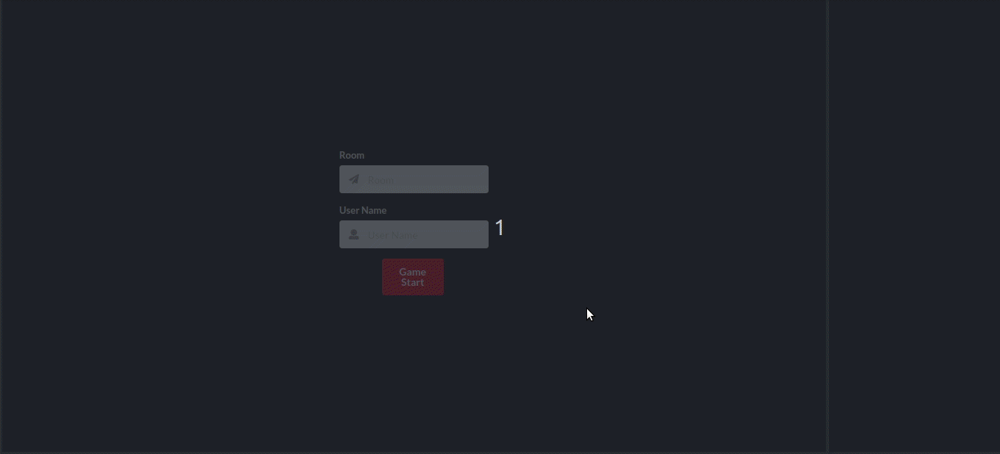

# Red Tetris

## Overview

Everyone says they know Javascript, but very few people have a really precise knowledge of this multi-faceted language which is at the same time partially functional, completely prototype oriented, of a diabolically dynamic type, passionately asynchronous and frighteningly efficient.

Red Tetris is a école 42 project to create <b>multiplayer tetris game</b> using <b>full-stack JavaScript</b>. This project lets you discover the fast-changing javascript ecosystem. You can freely choose any recent library, framework, etc., but it has the following limitations.

The client side code must be written in `functionnal proramming style`, whereas the server side code must be written in `object-oriented programming style`.

Unit tests must cover <b>at least 70% of the statements, functions, lines and at least 50%
of branches</b>

## Demo

[wpark-red-tetris.herokuapp.com](https://wpark-red-tetris.herokuapp.com/)
